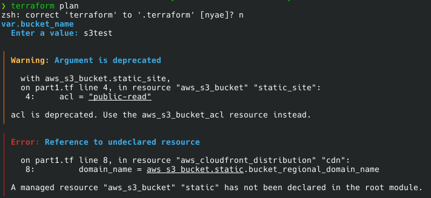
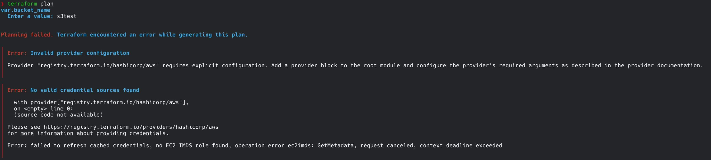

# Key Decisions

- **Use of ECS Fargate over EC2**: I chose to use ECS Fargate instead of EC2 because even though EC2 is cheaper, if a sudden spike hits, you have to wait for a new EC2 instance to boot, join the cluster and then start the container. In Faragate, you don't have to provision, configure or scale clusters of virtual machines to run containers making it ideal for production use.
- **Staging vs Production differences**: Staging omits WAF to reduce complexity and avoid false positives, in production is enabled for extra protction. Staging uses less resources (lower CPU/memory and desired count) than production to lower the cost.
- **Terraform splited to modules**: Seperated reusable modules for alb, cdn, ecs, iam ecr and waf to reduce the need to write again the same section for staging and production.
- **ALB + ECS**: I chose this compination because it lets you run and scale containers without managing servers and reducing operational overhead while staying flexible.
- **Seperate AWS account**: I would use a separate AWS account instead of just an isolated VPC because it provides a hard boundary for security, billing and API quotas. This prevents staging issues like breaches or rate-limit exhaustion from impacting production while the main tradeoff is higher setup complexity compared to the simpler isolation of VPC-level separation.
- **Seperate ECR repository**: I would use seperate ECR repositories for prod and staging for better security or accidental tag overwrite.

# Part 1
Screenshot after first running `terraform plan`



## Bug 1

The name of the bucket is different that the name that is referenced in line 8.

I changed the line from `aws_s3_bucket.static.bucket_regional_domain_name` to `aws_s3_bucket.static_site.bucket_regional_domain_name`

Also fixed the warning of the argument `acl` which is deprecated and replaced it with `aws_s3_bucket_acl`

## Bug 2



The provider block was missing and terraform didn't know what plugin to download.

I added the below code to fix it:

```hcl
provider "aws" {
  region = "us-east-1"
  access_key = "my-access-key"
  secret_key = "my-secret-key"
}
```

## Bug 3

The security issue with Trivy that will flag is that `acl` was set to `public-read`.

I added `aws_s3_bucket_ownership_controls` block so we can control the ownership of objects uploaded to the bucket.

Then I set the `acl` to `private`

```hcl
resource "aws_s3_bucket_ownership_controls" "static_site_ownership" {
    bucket = aws_s3_bucket.static_site.id
    rule {
        object_ownership = "BucketOwnerPreferred"
    }
}

resource "aws_s3_bucket_acl" "static_site_acl" {
    depends_on = [ aws_s3_bucket_ownership_controls.static_site_ownership ]

    bucket = aws_s3_bucket.static_site.id
    acl    = "private"
}I chose Fargate because of faster scaling and less infrastructure management
```

## Bug 4

The CloudFront distribution was configured with an S3 origin but without `s3_origin_config` and an Origin Access Control, which is required for a private S3 bucket origin using SigV4.

I replaced `aws_cloudfront_origin_access_identity` with `aws_cloudfront_origin_access_control`, updated `aws_cloudfront_distribution.cdn` to use `origin_access_control_id`, and kept the bucket private with a policy allowing the CloudFront service principal to read objects from `aws_s3_bucket.static_site`.

```hcl
resource "aws_cloudfront_origin_access_control" "cdn_oac" {
  name                              = "cdn-oac"
  description                       = "OAC for S3 static site"
  origin_access_control_origin_type = "s3"
  signing_protocol                  = "sigv4"
  signing_behavior                  = "always"
}

resource "aws_s3_bucket_policy" "static_site_policy" {
  bucket = aws_s3_bucket.static_site.id

  policy = jsonencode({
    Version = "2012-10-17"
    Statement = [
      {
        Sid    = "AllowCloudFrontServicePrincipalReadOnly"
        Effect = "Allow"
        Principal = {
          Service = "cloudfront.amazonaws.com"
        }
        Action = [
          "s3:GetObject"
        ]
        Resource = "${aws_s3_bucket.static_site.arn}/*"
      }
    ]
  })
}
```

# Part 2

## EC2 vs ECS Fargate

I chose to use ECS Fargate instead of EC2 because even though EC2 is cheaper, if a sudden spike hits, you have to wait for a new EC2 instance to boot, join the cluster and then start the container. In Faragate, you don't have to provision, configure or scale clusters of virtual machines to run containers making it ideal for production use.

## Isolation approach

For this implementation, I would use a seperate AWS account because it has a hard boundary for security, billing and api quottas.

- A breach in staging is physically locked out of Production
- Easier billing as is seperated by the account
- A bug in staging can hit AWS rate limits and take down Production. With seperate accounts you avoid this.

The tradoff is the lower initial setup with isolated VPC. Also there is a network layer protection because resources of one VPC cannot communicate with resources of another VPC.

## Reduced task sizing for ECS Fargate

I reduced the below values:

- `desired_count` from 4 to 2. **Lowest value should be 2 to test rolling updates**
- `cpu` from 512 to 256. **Reduced cpu because in production we always add more to guarantee stability**
- `memory` from 1024 to 512. **Reduced memory because in production we always add more to guarantee stability**

## WAF not required in staging

You don't need WAF in staging because it reduces the complexity for internal testing as WAFs are nottoriouus for "False Positives". For example, it might block a developers's legitimate API call or a manual QA test because the payload looks "suspicious". Also is more cost efficient if you remove WAF in staging bringing the cost down.

The risk that carries is that you might write a code that works in staging but gets blocked by WAF in prodution.

## Terraform Commands

- Production

**terraform init**

```
Initializing the backend...
Initializing modules...
- alb in ../../modules/alb
- cdn in ../../modules/cdn
- ecs in ../../modules/ecs
- iam in ../../modules/iam
- repo in ../../modules/ecr
- waf in ../../modules/waf
Initializing provider plugins...
- Finding latest version of hashicorp/aws...
- Finding latest version of hashicorp/tls...
- Installing hashicorp/aws v6.40.0...
- Installed hashicorp/aws v6.40.0 (signed by HashiCorp)
- Installing hashicorp/tls v4.2.1...
- Installed hashicorp/tls v4.2.1 (signed by HashiCorp)
Terraform has created a lock file .terraform.lock.hcl to record the provider
selections it made above. Include this file in your version control repository
so that Terraform can guarantee to make the same selections by default when
you run "terraform init" in the future.

Terraform has been successfully initialized!

You may now begin working with Terraform. Try running "terraform plan" to see
any changes that are required for your infrastructure. All Terraform commands
should now work.

If you ever set or change modules or backend configuration for Terraform,
rerun this command to reinitialize your working directory. If you forget, other
commands will detect it and remind you to do so if necessary.
```

**terraform plan**

Output saved in [tf-plan-prod.txt](part2/tf-plan-prod.txt)

- Staging

**terraform init**

```
Initializing the backend...
Initializing modules...
- alb in ../../modules/alb
- cdn in ../../modules/cdn
- ecs in ../../modules/ecs
- iam in ../../modules/iam
- repo in ../../modules/ecr
Initializing provider plugins...
- Finding latest version of hashicorp/aws...
- Finding latest version of hashicorp/tls...
- Installing hashicorp/aws v6.40.0...
- Installed hashicorp/aws v6.40.0 (signed by HashiCorp)
- Installing hashicorp/tls v4.2.1...
- Installed hashicorp/tls v4.2.1 (signed by HashiCorp)
Terraform has created a lock file .terraform.lock.hcl to record the provider
selections it made above. Include this file in your version control repository
so that Terraform can guarantee to make the same selections by default when
you run "terraform init" in the future.

Terraform has been successfully initialized!

You may now begin working with Terraform. Try running "terraform plan" to see
any changes that are required for your infrastructure. All Terraform commands
should now work.

If you ever set or change modules or backend configuration for Terraform,
rerun this command to reinitialize your working directory. If you forget, other
commands will detect it and remind you to do so if necessary.
```

**terraform plan**

Output saved in [tf-plan-staging.txt](part2/tf-plan-staging.txt)

# Part 3

- Root causes

  - **Root cause 1**: Missing Dockerfile. The error `open Dockerfile: no such file or directory` indicates that the Dockerfile is missing from the workspace. Probably there was no checkout step.

  - **Root cause 2**: Invalid AWS Authentication. The error `The security token included in the request is expired.` indicates that the credentials have exceeded their validity period.

- Dependency error: The error `FATAL image not found in local store` is dependent on Root cause 1. Because `docker build` failed, it didn't create the image in the local storage and Trivy tried to scan an images that never was created. You have to fix it in the correct order so that the image will be build and then run the Trivy scan.

- Corrected workflow section. I added a "Checkout Code" step to download the Dockerfile and a "Configure AWS credentials" step to refresh AWS credentials before login.

```yaml
jobs:
  deploy:
    runs-on: ubuntu-latest
    steps:
      - name: Checkout Code
        uses: actions/checkout@v4

      - name: Build Docker image
        run: |
          docker build -t $ECR_REGISTRY/$ECR_REPO:$IMAGE_TAG .

      - name: Scan image with Trivy
        run: |
          trivy image --exit-code 1 --severity HIGH,CRITICAL \
          $ECR_REGISTRY/$ECR_REPO:$IMAGE_TAG

      - name: Configure AWS credentials
        uses: aws-actions/configure-aws-credentials@v4
        with:
          aws-access-key-id: ${{ secrets.AWS_ACCESS_KEY_ID }}
          aws-secret-access-key: ${{ secrets.AWS_SECRET_ACCESS_KEY }}
          aws-region: ${{ secrets.AWS_REGION }}

      - name: Login to ECR
        run: |
          aws ecr get-login-password --region $AWS_REGION | docker login \
          --username AWS --password-stdin $ECR_REGISTRY
```

# Technical Questions

- **Q1**:
Internaly the url work but externally it doesn't. This must be because the ingress controller doesn't work, probably missing, blocked or not redirecting correctly.
- **Q3**:
The rollback strategy is
  - Remove the `NOT NULL` constrain. TThis makes sure that the old code doesn't crash when it ingores the new column during `INSERT` operations.
  - Execute kubernetes rollback. This will revert the deployment to the previous stable version.
  - Monitor pod health to very that the older pods are reaching a `Ready` state.
  - Check if any "null" values are created during the rollback and correct them.
  - Once the application is stable, drop the column.
- **Q4**:
Shipping logs directly from an application pod to a remote log server is a bad idea because:
  - If the log server goes down, you lose he logs.
  - The security will be more complex because you'll need credentials or certificates to write to the log server for every pod
  - Performance will take a hit because your application has to spend CPU and memory to send the logs. If the log server is slow, it can create a slowdown for your application also.
  - Scaling problems. When you have many pods, you'll have many connecion making the log server to overload.
Log Aggregator can help when:
  - Apps justt write to stdout and devops can handle the rest
  - Prevents log loss during outages
  - Automatically atttaches kubernetes metadata to every log line before it leaves the cluster.
  - Compresses logs
You can skip it in very small setups and non-crittical enviroments